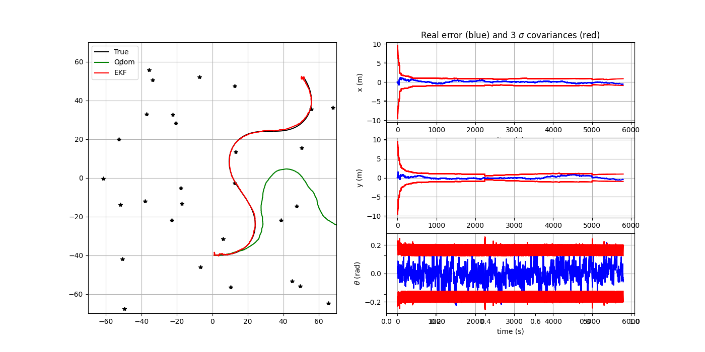
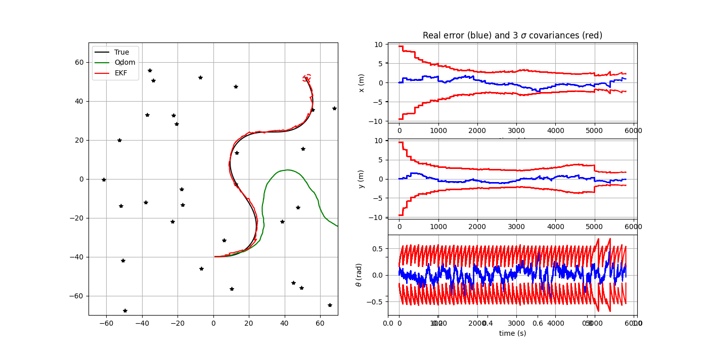
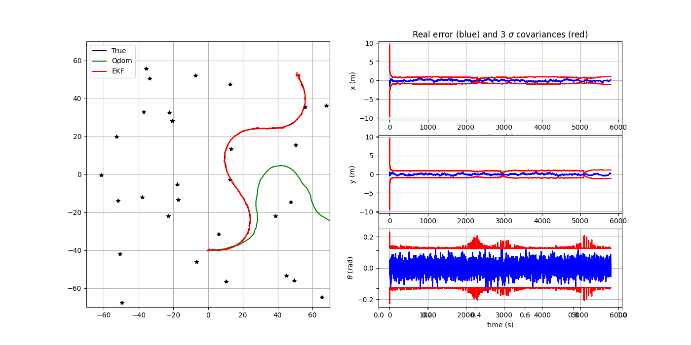
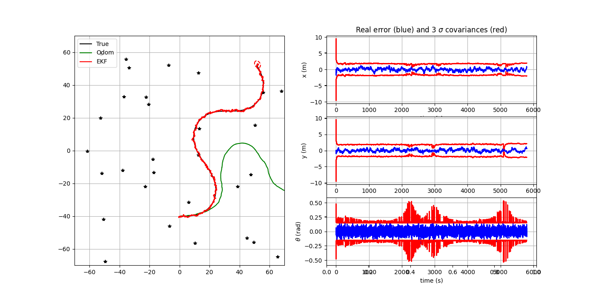
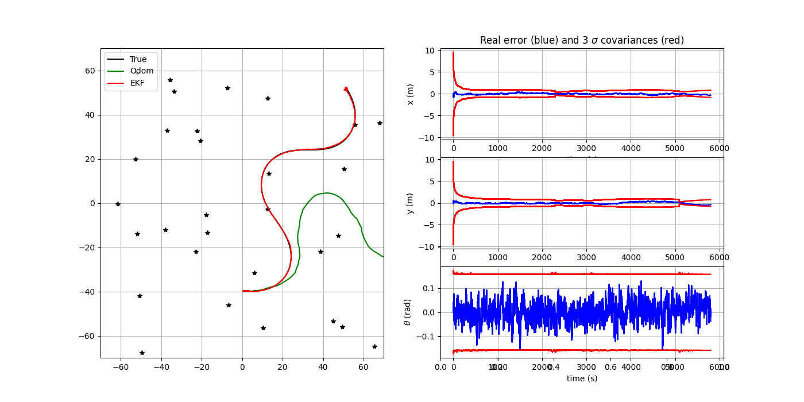
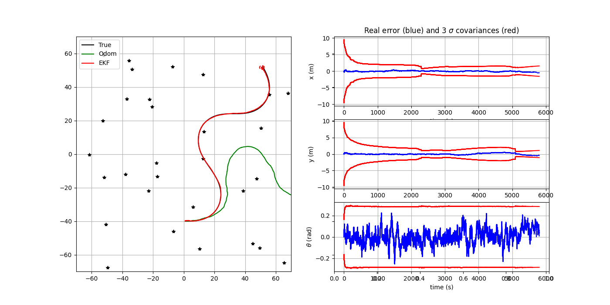
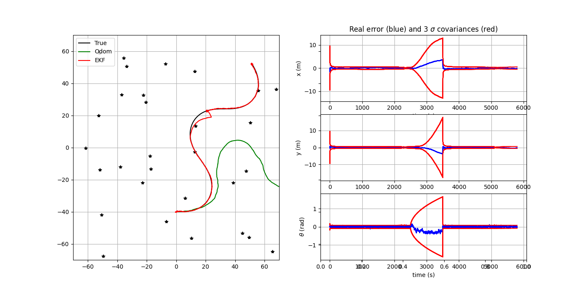
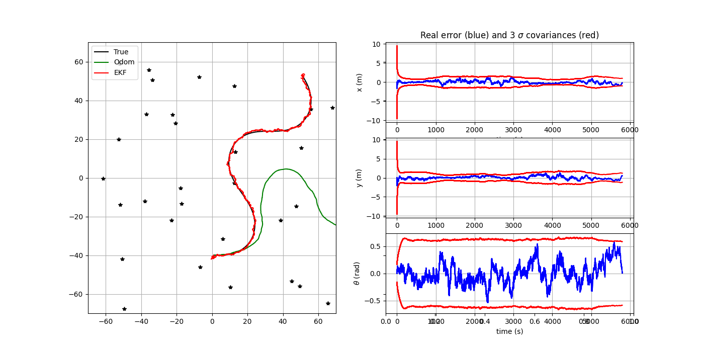
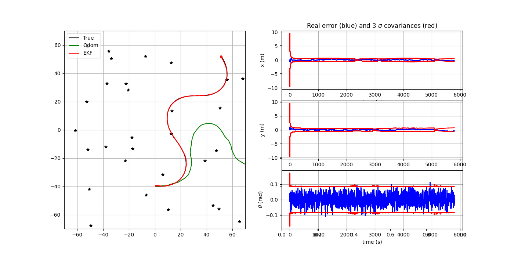

## 1) Structure générale du code et paramètres du filtre de Kalman

Le code est une simulation complète d’un **filtre de Kalman étendu (EKF)** appliqué à la **localisation d’un robot mobile** se déplaçant dans un environnement avec des **points de repère (landmarks)**.
Il est structuré en plusieurs grandes parties, chacune correspondant à un sous-système du problème :

---

### 1. **Simulation du véhicule (classe `Simulation`)**

La classe `Simulation` représente le **monde réel**.
Elle génère la trajectoire « vraie » du robot et les mesures bruitées utilisées par le filtre.

* `simulate_world(k)` : met à jour la **position réelle** du robot selon un modèle de mouvement défini par `tcomp`.
* `get_robot_control(k)` : génère la **commande** du robot (vitesse et rotation) pour une trajectoire sinusoïdale.
* `get_odometry(k)` : simule les **mesures d’odométrie bruitées** selon une covariance de bruit `QTrue`.
* `get_observation(k)` : simule les **observations bruitées** des points de repère (landmarks), selon une covariance `RTrue`.

Ces fonctions utilisent des nombres aléatoires pour modéliser l’incertitude, mais le `seed` fixé garantit la **reproductibilité**.

---

### 2. **Modèles du filtre de Kalman**

#### a. **Modèle d’évolution (`motion_model`)**

C’est la fonction ( f(x, u) ) du filtre.
Elle décrit comment l’état du robot ([x, y, \theta]) évolue en fonction de la commande (u = [V_x, V_y, \omega]) et du pas de temps `dt_pred`.

#### b. **Modèle d’observation (`observation_model`)**

C’est la fonction ( h(x) ).
Elle relie l’état du robot à ce qu’il « observe » : la distance et l’angle entre le robot et un landmark.

#### c. **Jacobiennes du modèle**

Les matrices de dérivées partielles nécessaires au filtre sont calculées dans :

* `F(x, u, dt_pred)` : Jacobienne de ( f ) par rapport à l’état (utilisée pour propager la covariance `P`).
* `G(x, u, dt_pred)` : Jacobienne de ( f ) par rapport au bruit de commande.
* `get_obs_jac(xPred, iFeature, Map)` : Jacobienne de ( h ) par rapport à l’état (utilisée pour la mise à jour des observations).

---

### 3. **Paramètres principaux du filtre de Kalman**

| Nom du paramètre     | Rôle                                                                                  |
| -------------------- | ------------------------------------------------------------------------------------- |
| `xEst`, `PEst`       | État estimé et covariance associée du filtre                                          |
| `QEst`, `REst`       | Covariances des bruits de processus et de mesure modélisés par le filtre              |
| `QTrue`, `RTrue`     | Covariances « réelles » utilisées dans la simulation (différentes de celles estimées) |
| `dt_pred`, `dt_meas` | Pas de temps de prédiction et d’observation                                           |
| `xTrue`, `xOdom`     | Position réelle et odométrie simulée du robot                                         |
| `Map`                | Coordonnées des landmarks dans le monde                                               |

---

### 4. **Boucle principale de la simulation**

La boucle temporelle (for `k in range(1, simulation.nSteps)`) met en œuvre la séquence typique du filtre de Kalman :

1. **Prédiction**

   * Le robot se déplace (`simulate_world`).
   * L’odométrie bruitée est lue (`get_odometry`).
   * Le filtre prédit le prochain état (`motion_model`) et met à jour la covariance avec `F` et `G`.

2. **Mise à jour (correction)**

   * Si une observation `z` est disponible (`get_observation`), le filtre :

     * Calcule la mesure prédite `zPred`.
     * Calcule l’innovation ( z - zPred ).
     * Met à jour l’état estimé et la covariance selon les équations de l’EKF.

3. **Enregistrement et affichage**

   * Les états vrai, odométrique et estimé sont enregistrés.
   * Les erreurs et variances sont affichées périodiquement avec les ellipses de covariance.

---

### 5. **Visualisation et analyse**

Les fonctions de visualisation (`plot_covariance_ellipse` et les plots matplotlib) permettent :

* de comparer la trajectoire vraie, odométrique et estimée ;
* de visualiser les incertitudes (ellipses de covariance) ;
* de suivre les erreurs (x, y, \theta) en fonction du temps.

---

### 6. **Résumé de l’agencement global**

| Bloc de code          | Fonction principale                                |
| --------------------- | -------------------------------------------------- |
| **Simulation**        | Génère la réalité physique et les mesures bruitées |
| **Modèles du filtre** | Définissent la dynamique et la perception du robot |
| **Jacobiennes**       | Linearisation des modèles pour l’EKF               |
| **Boucle principale** | Exécution séquentielle : prédiction → correction   |
| **Affichage**         | Visualisation des trajectoires et incertitudes     |

---

## 2) Résultat du code complet du filtre

Avec le code complet du filtre, on obtient le résultat suivant :

---

## 3) Variation de la fréquence des mesures (`dt_meas`)

Le paramètre `dt_meas` définit la fréquence à laquelle les mesures des capteurs (observations des *landmarks*) sont effectuées.
La condition `if k*self.dt_pred % self.dt_meas == 0:` indique quand une nouvelle mesure est générée.
Ainsi, augmenter `dt_meas` fait que les mesures se produisent moins fréquemment, ce qui réduit les mises à jour correctives du filtre et augmente l’erreur entre les corrections (la trajectoire estimée tend à s’éloigner davantage de la trajectoire réelle entre les mesures).

Dans la figure ci-dessous, `dt_meas` a un coefficient de **10** :

Dans la figure ci-dessous, `dt_meas` a un coefficient de **100** :

---

## 4) Variation du bruit dynamique (`QEst`)

Augmenter `QEst` (bruit dynamique du filtre) signifie que le filtre fait moins confiance au modèle de mouvement et davantage aux mesures.
On observe que l’augmentation de `QEst` entraîne une plus grande dispersion de la trajectoire prédite et des covariances, mais le filtre tend à se réajuster grâce aux observations, montrant ainsi une certaine robustesse.

Dans la figure ci-dessous, `QEst` a un coefficient de **10** :

Dans la figure ci-dessous, `QEst` a un coefficient de **100** :

---

## 5) Variation du bruit de mesure (`REst`)

Augmenter `REst` (bruit de mesure) fait que le filtre fait moins confiance aux observations et davantage à la prédiction.
Cela se traduit par des covariances plus grandes (incertitude accrue), mais la trajectoire générale reste cohérente.
Le filtre montre sa robustesse, car même avec des mesures moins fiables, l’estimation ne diverge pas significativement.

Dans la figure ci-dessous, `REst` a un coefficient de **10** :

Dans la figure ci-dessous, `REst` a un coefficient de **100** :

---

## 6) Absence de mesures entre 2500 s et 3500 s

En interrompant les mesures entre **2500 s et 3500 s**, le filtre fonctionne uniquement en phase de prédiction, sans corrections.
Pendant cette période, l’erreur augmente progressivement et l’incertitude (covariance) croît.
Dès que les mesures reprennent, le filtre se réajuste rapidement à la trajectoire réelle, retrouvant l’alignement.

Résultat du système :

---

## 7) Variation du nombre de *landmarks*

Les *landmarks* sont essentiels pour corriger les estimations du filtre.
Réduire leur nombre diminue la quantité d’informations disponibles pour la correction, ce qui compromet la précision de la trajectoire et augmente les incertitudes.
Avec de nombreux *landmarks*, le filtre converge plus rapidement et maintient une trajectoire plus proche de la réalité.

---

## 8) Mesures uniquement de distance (*range only*)

Lorsque seules les mesures de distance sont disponibles, le filtre perd l’information angulaire, ce qui rend plus difficile la détermination de la position latérale du robot par rapport au *landmark*.
Cela entraîne des incertitudes plus importantes sur les axes x et y, mais la trajectoire peut encore être suivie partiellement, surtout si plusieurs *landmarks* sont répartis sur la carte.

Résultat du système :

---

## 9) Mesures uniquement de direction (*angle only*)

Lorsque seules les mesures de direction (angle) sont disponibles, le filtre peut encore estimer la position si le robot se déplace et observe plusieurs *landmarks*, car le mouvement fournit des informations indirectes sur la distance.
Cependant, les incertitudes augmentent fortement et la convergence est plus lente.
Avec peu de *landmarks*, le filtre devient moins observable et la trajectoire peut se dégrader.

Résultat du système :

