## 1) Structure générale du code et paramètres du filtre particulaire 

Le code est une simulation complète d’un **filtre particulaire** appliqué à la **localisation d’un robot mobile** se déplaçant dans un environnement avec des **points de repère (landmarks)**.
Il est structuré en plusieurs grandes parties, chacune correspondant à un sous-système du problème :

---

### 1. **Simulation du véhicule (classe `Simulation`)**

La classe `Simulation` représente le **monde réel**.
Elle génère la trajectoire « vraie » du robot et les mesures bruitées utilisées par le filtre.

* `simulate_world(k)` : met à jour la **position réelle** du robot selon un modèle de mouvement défini par `tcomp`.
* `get_robot_control(k)` : génère la **commande** du robot (vitesse et rotation) pour une trajectoire sinusoïdale.
* `get_odometry(k)` : simule les **mesures d’odométrie bruitées** selon une covariance de bruit `QTrue`.
* `get_observation(k)` : simule les **observations bruitées** des points de repère (landmarks), selon une covariance `RTrue`.

Ces fonctions utilisent des nombres aléatoires pour modéliser l’incertitude, mais le `seed` fixé garantit la **reproductibilité**.

---

### 2. **Modèles du filtre particulaire**

#### a. **Modèle d’évolution (`motion_model`)**

C’est la fonction ( f(x, u, w) ) du filtre particulaire.
Elle décrit comment chaque **particule** représentant l’état du robot ([x, y, \theta]) évolue à partir de la commande (u = [V_x, V_y, \omega]) et du pas de temps `dt_pred`.

À chaque itération, le filtre :

* propage **indépendamment** chaque particule selon le modèle de mouvement ;
* ajoute un **bruit de processus** tiré de la distribution ( \mathcal{N}(0, Q_{Est}) ), simulant l’incertitude sur le mouvement réel.

Cette étape correspond à la **phase de prédiction** du filtre, où l’on anticipe la position probable du robot avant d’obtenir de nouvelles mesures.

---

#### b. **Modèle d’observation (`observation_model`)**

C’est la fonction ( h(x) ) du filtre particulaire.
Elle prédit la mesure ( z_{pred} ) qu’un robot situé en (x) observerait vis-à-vis d’un landmark connu dans la carte `Map`.

Pour chaque particule :

* on calcule la distance et l’angle entre le robot (particule) et le landmark observé ;
* on compare cette mesure prédite à la mesure réelle ( z ) ;
* on met à jour le **poids de la particule** selon la probabilité gaussienne de l’innovation ( (z - z_{pred}) ).

Les particules plus cohérentes avec la mesure reçoivent un poids plus élevé, renforçant leur influence dans l’estimation.

---

#### c. **Fonction de ré-échantillonnage (`re_sampling`)**

Cette fonction implémente le **low-variance (ou systematic) resampling**, une étape essentielle du filtre particulaire.
Au fil des itérations, certains poids deviennent très grands tandis que d’autres tendent vers zéro — phénomène appelé **dégénérescence**.
Le ré-échantillonnage permet de **conserver la diversité** du nuage de particules en éliminant les particules peu probables et en dupliquant celles qui ont un poids élevé.

**Principe du “low-variance resampling” :**

1. On construit la **somme cumulée** des poids normalisés.
2. On tire un **seul nombre aléatoire** ( r \sim U(0, 1/N) ).
3. On sélectionne ensuite ( N ) particules à intervalles réguliers :
   [
   u_i = r + \frac{i-1}{N}, \quad i = 1, 2, ..., N
   ]
   Chaque ( u_i ) détermine quelle particule cumulative est choisie.
4. Le résultat est un nouvel ensemble de particules dont les poids sont uniformes (égaux à (1/N)).

Ce procédé est plus efficace et présente **une variance d’échantillonnage plus faible** que le ré-échantillonnage multinomial classique, tout en restant simple à implémenter.
Il garantit que les particules importantes sont répliquées de manière proportionnelle à leur poids, sans introduire trop d’aléa.

---

### 3. **Paramètres principaux du filtre particulaire**

| Nom du paramètre     | Rôle                                                        |
| -------------------- | ----------------------------------------------------------- |
| `xParticles`, `wp`   | Ensemble des particules et leurs poids associés             |
| `xEst`, `xSTD`       | Moyenne pondérée et écart-type de l’état estimé             |
| `QEst`, `REst`       | Covariances modélisées des bruits de processus et de mesure |
| `QTrue`, `RTrue`     | Covariances « réelles » utilisées dans la simulation        |
| `dt_pred`, `dt_meas` | Pas de temps de prédiction et d’observation                 |
| `xTrue`, `xOdom`     | Position réelle et odométrique simulée du robot             |
| `Map`                | Coordonnées des landmarks dans le monde                     |
| `nParticles`         | Nombre de particules dans le filtre                         |

---

### 4. **Boucle principale de la simulation**

La boucle temporelle (`for k in range(1, simulation.nSteps)`) suit la séquence typique d’un **filtre particulaire** :

1. **Prédiction**

   * Chaque particule est propagée par `motion_model` avec un bruit aléatoire.
   * On obtient une distribution de particules représentant la croyance a priori sur la position du robot.

2. **Correction (mise à jour)**

   * Si une observation `z` est disponible :

     * On prédit la mesure `zPred` pour chaque particule (`observation_model`).
     * On calcule l’erreur d’observation (innovation) et on met à jour les poids `wp`.
     * Les poids sont normalisés pour que leur somme soit égale à 1.

3. **Ré-échantillonnage**

   * Si la **taille effective de l’échantillon** ( ( N_{eff} = 1 / \sum w_i^2 ) ) devient trop faible,
     la fonction `re_sampling` est appelée pour régénérer un ensemble équilibré de particules.

4. **Estimation**

   * L’état estimé `xEst` est calculé comme la moyenne pondérée des particules.
   * L’incertitude `xSTD` est dérivée de la variance pondérée.

5. **Enregistrement et visualisation**

   * Les trajectoires réelles, odométriques et estimées sont enregistrées.
   * Les écarts et incertitudes sont affichés à intervalles réguliers.

---

### 5. **Visualisation et analyse**

Les fonctions de visualisation permettent :

* de comparer la trajectoire vraie, odométrique et estimée ;
* d’observer la dispersion des particules à chaque instant ;
* de suivre la convergence du filtre en fonction du temps et du nombre de particules.

---

### 6. **Résumé de l’agencement global**

| Bloc de code             | Fonction principale                                                |
| ------------------------ | ------------------------------------------------------------------ |
| **Simulation**           | Génère la réalité physique et les mesures bruitées                 |
| **Modèles du filtre**    | Définissent la dynamique et la perception du robot                 |
| **Poids des particules** | Évaluent la vraisemblance de chaque hypothèse                      |
| **Ré-échantillonnage**   | Préserve la diversité et élimine les particules faibles            |
| **Boucle principale**    | Exécute la séquence : prédiction → correction → ré-échantillonnage |
| **Affichage**            | Visualise la trajectoire et la distribution des particules         |

---

## 2) Résultat du code complet du filtre

Avec le code complet du filtre, on obtient le résultat suivant :

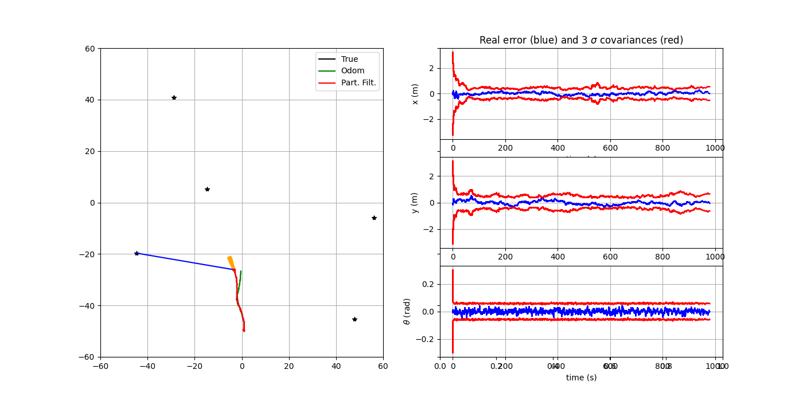

Avec tous les pas : 

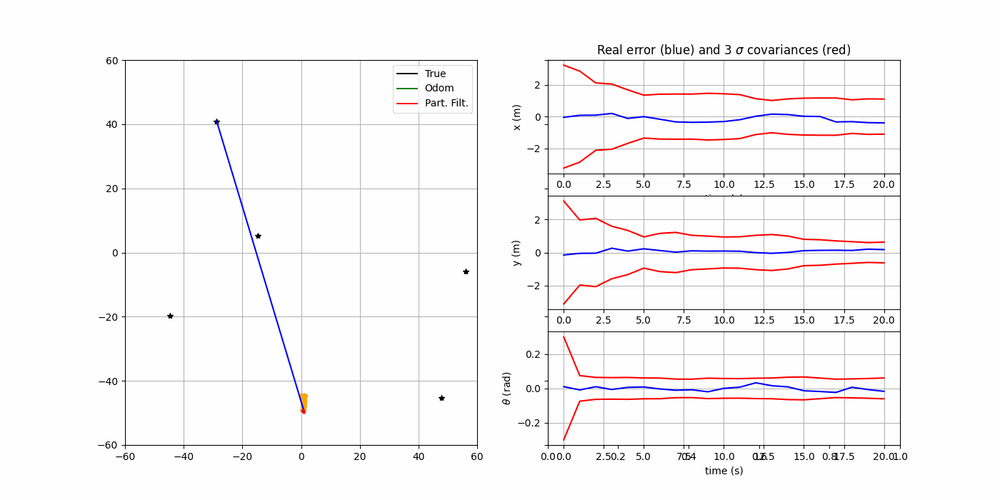

---

## 3) Variation du bruit dynamique (`QEst`)

Augmenter `QEst` (le bruit dynamique du modèle) signifie que le filtre attribue moins de confiance à la modélisation du mouvement et suppose que le robot peut dévier davantage de la commande attendue.

Dans un filtre particulaire, cela se traduit par une plus grande dispersion des particules après la phase de prédiction.
Chaque particule explore alors une zone plus large de l’espace d’état, ce qui peut aider à couvrir plusieurs hypothèses possibles lorsque le modèle de mouvement est incertain.

Cependant, un `QEst` trop grand rend la prédiction trop aléatoire : les particules s’éloignent excessivement et la densité de probabilité devient bruitée. Le ré-échantillonnage peut alors éliminer prématurément certaines particules pertinentes.

Globalement :

* **Petit `QEst`** → mouvement trop confiant, risque de perte de suivi si le modèle est erroné ;
* **Grand `QEst`** → exploration accrue, mais convergence plus lente et trajectoire moins stable.

Le filtre particulaire reste néanmoins robuste, car les mesures successives réajustent progressivement la distribution des particules autour de la position correcte.

Dans la figure ci-dessous, `QEst` a un coefficient de **10** :

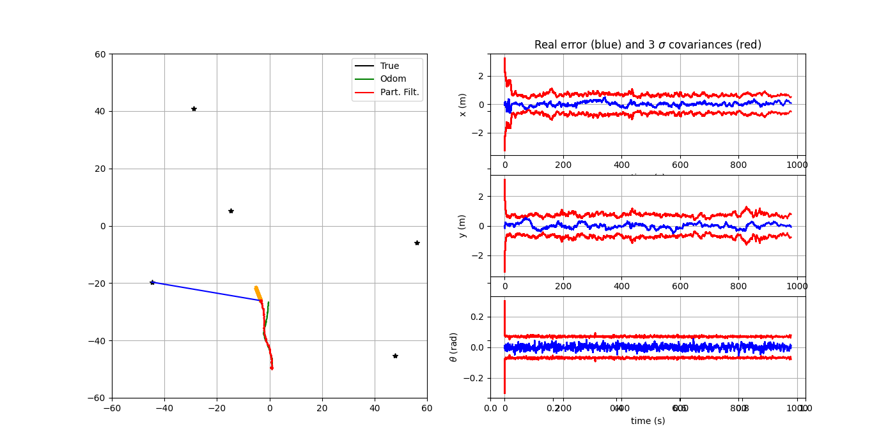

Dans la figure ci-dessous, `QEst` a un coefficient de **100** :

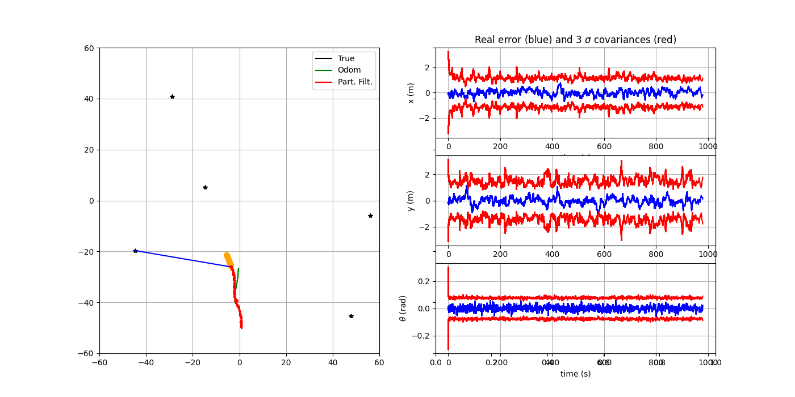

---

## 4) Variation du bruit de mesure (`REst`)

Augmenter `REst` (le bruit du modèle de mesure) signifie que le filtre fait moins confiance aux observations et laisse davantage de poids à la prédiction issue du modèle de mouvement.

Dans un filtre particulaire, cela réduit l’influence de la mise à jour des poids :
les particules reçoivent des poids plus proches les uns des autres, ce qui ralentit la correction après une mauvaise estimation.
L’incertitude apparente augmente (le nuage de particules devient plus large), mais la trajectoire moyenne reste souvent cohérente si les observations sont encore suffisantes pour corriger la tendance globale.

À l’inverse, un `REst` trop faible rend le filtre trop confiant dans les mesures, ce qui provoque des fluctuations rapides des poids : seules quelques particules gardent une probabilité élevée, et la diversité du nuage diminue rapidement, augmentant le risque de **dégénérescence** avant le ré-échantillonnage.

En résumé :

* **Petit `REst`** → correction forte, mais risque de perte de diversité ;
* **Grand `REst`** → correction faible, incertitude accrue, mais évolution plus fluide.

Dans la figure ci-dessous, `REst` a un coefficient de **10** :

Dans la figure ci-dessous, `REst` a un coefficient de **100** :

---

## 5) Variation du seuil de ré-échantillonnage (`theta_eff`)

Le paramètre `theta_eff` définit le seuil de dégénérescence du filtre, c’est-à-dire la valeur minimale du nombre effectif de particules ( N_{\text{eff}} = 1 / \sum w_i^2 ) avant de déclencher un ré-échantillonnage.

Lorsque les poids deviennent très inégaux — certaines particules concentrant la quasi-totalité de la probabilité — on parle de dégénérescence.
Le ré-échantillonnage permet alors de **régénérer un ensemble équilibré** de particules, en supprimant celles dont les poids sont faibles et en dupliquant les plus représentatives.

* Avec une valeur faible de `theta_eff`, le ré-échantillonnage se produit rarement : le nuage de particules se dégrade plus rapidement, car quelques particules dominent le poids total.
  → Le histogramme des poids est alors fortement décalé vers la gauche (beaucoup de poids proches de zéro).

* Avec une valeur élevée de `theta_eff`, le ré-échantillonnage se produit très souvent : la diversité est préservée, mais au prix d’une réduction de la variabilité naturelle entre les particules (effet de lissage).

Un compromis est observé pour `theta_eff ≈ 0.5`, où la diversité reste suffisante sans excès de ré-échantillonnage.
Ce réglage maintient un équilibre entre exploration (diversité des hypothèses) et exploitation (concentration autour de la solution la plus probable).

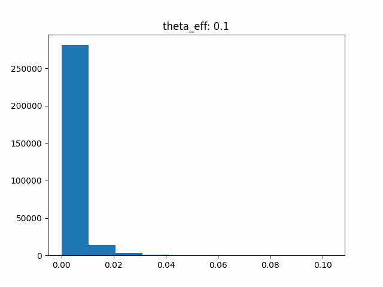

---

## 6) Absence de mesures entre 250 s et 350 s

En interrompant les mesures entre **250 s et 350 s**, le filtre fonctionne uniquement en phase de prédiction, sans corrections.
Pendant cette période, l’erreur augmente progressivement et l’incertitude (covariance) croît.
Dès que les mesures reprennent, le filtre se réajuste rapidement à la trajectoire réelle, retrouvant l’alignement.

Résultat du système :

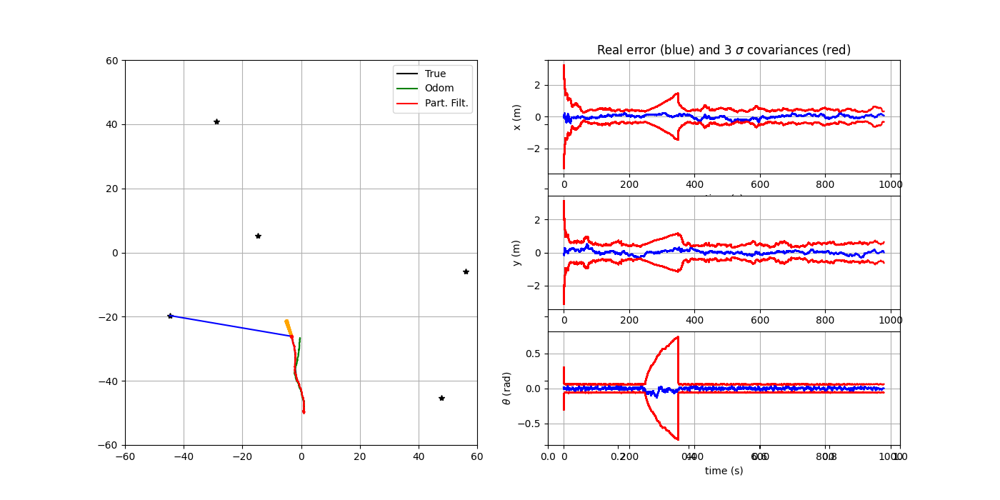

---
## 7) Variation de la fréquence des mesures (`dt_meas`)

Le paramètre `dt_meas` définit la fréquence à laquelle les mesures des capteurs (observations des *landmarks*) sont effectuées.
La condition `if k*self.dt_pred % self.dt_meas == 0:` indique quand une nouvelle mesure est générée.
Ainsi, augmenter `dt_meas` fait que les mesures se produisent moins fréquemment, ce qui réduit les mises à jour correctives du filtre et augmente l’erreur entre les corrections (la trajectoire estimée tend à s’éloigner davantage de la trajectoire réelle entre les mesures).

Dans la figure ci-dessous, `dt_meas` a un valeur de **10** (0,1 Hz) :

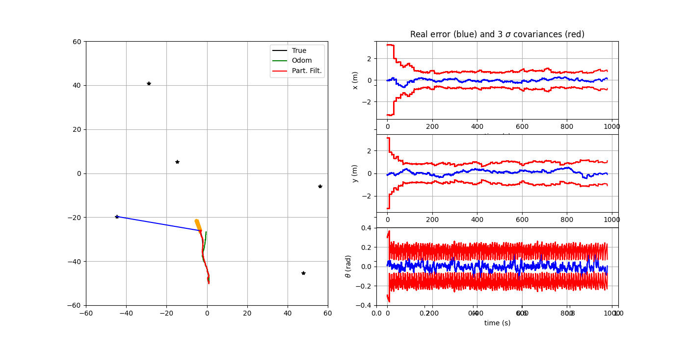

---
## 8) Variation du nombre de *landmarks*

Les *landmarks* jouent un rôle crucial dans la correction du filtre particulaire : ils fournissent les informations de mesure nécessaires pour ajuster la distribution de particules.

Réduire leur nombre diminue la quantité d’informations disponibles, ce qui affaiblit la mise à jour des poids et rend la trajectoire estimée moins précise.
L’incertitude augmente, et le filtre met plus de temps à converger.

Inversement, avec un plus grand nombre de *landmarks*, les observations deviennent plus redondantes et cohérentes, permettant une convergence plus rapide et une trajectoire estimée plus proche de la réalité.

En dessous de trois *landmarks*, le filtre ne parvient plus à localiser correctement le robot, car il n’a pas assez de contraintes géométriques pour estimer la position et l’orientation.
Au-delà de 3 *landmarks*, l’amélioration reste marginale : la redondance supplémentaire n’apporte qu’un gain limité.

**Remarque :** Le scénario de référence de cette application utilise 5 *landmarks*.

Trajectoire avec **3 landmarks** :

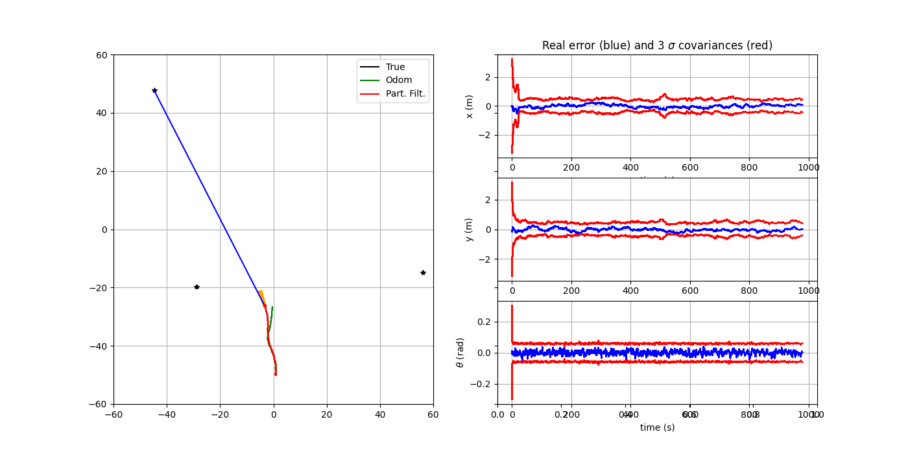

Trajectoire avec **10 landmarks** :

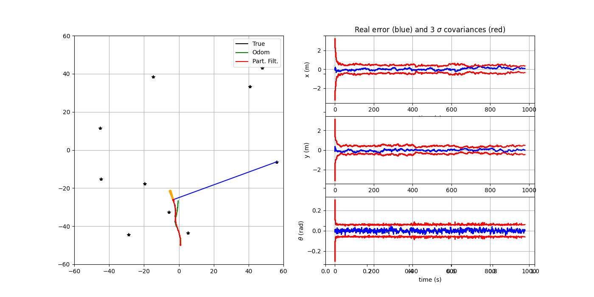

---

## 9) Ré-échantillonnage des poids

Différentes stratégies de ré-échantillonnage influencent la variance des estimations et la complexité algorithmique du filtre.

* Le **Multinomial Resampling** consiste à tirer chaque particule indépendamment selon sa probabilité.
  Ce procédé est simple à implémenter mais introduit une variance d’échantillonnage élevée : certaines particules peuvent être sélectionnées plusieurs fois tandis que d’autres disparaissent totalement.
  Cela rend la distribution légèrement plus bruitée, même si, dans cet exemple, l’impact sur la trajectoire globale reste faible.

* Le **Stratified Resampling**, au contraire, divise l’intervalle de probabilité en sous-espaces réguliers et tire une particule dans chacun d’eux.
  Cela réduit la variance et offre une répartition plus homogène des particules.
  La trajectoire estimée devient plus stable et la dispersion du nuage est mieux maîtrisée.

En termes de complexité, les deux approches sont de l’ordre de ( O(N) ), mais le *stratified* offre un compromis optimal entre simplicité et faible variance, ce qui le rend souvent préférable pour des applications robotiques.

Résultat du système avec **Multinomial Resampling** :

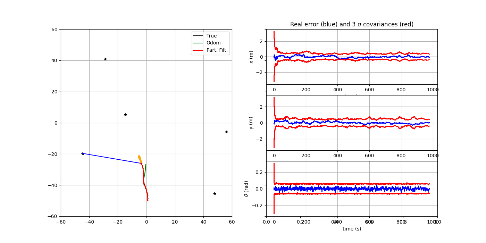

Résultat du système avec **Stratified Resampling** :

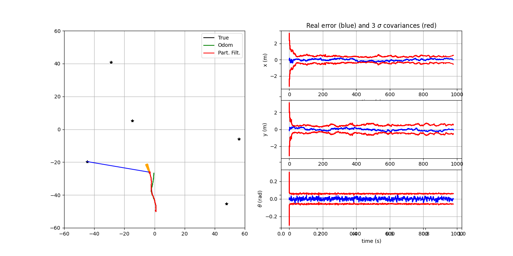

